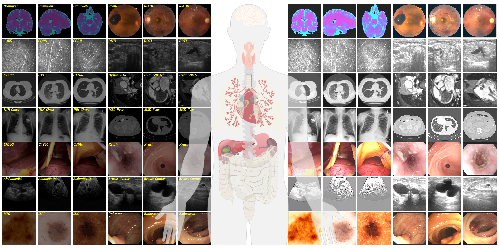

This repository contains PyTorch implementation for __Lightening Anything in Medical Images__.





# UniMIE: Lightening Anything in Medical Images
The development of medical imaging techniques has significantly contributed to clinical decision-making. However, suboptimal imaging quality, characterized by non-uniform illumination or imbalanced intensity, presents considerable challenges in automating disease screening, analysis, and diagnosis. Previous approaches for natural image enhancement are mostly trained with numerous paired images, presenting challenges in terms of data collection and training expenses, all while lacking the ability to generalize effectively. Here, we introduce a pioneering Patch-based Diffusion Model for Medical Image Enhancement, named UniMIE. UniMIE does not require any fine-tuning and solely relies on a single pre-trained model from ImageNet to showcase its unsupervised enhancement capabilities across all medical images from various modalities. We conduct a comprehensive evaluation on 13 imaging modalities and over 15 medical types, demonstrating better qualities, robustness, and accuracy than other modality-specific and data-inefficient models. By delivering high-quality enhancement and corresponding accuracy downstream tasks across a wide spectrum of tasks, UniMIE exhibits a significant potential to accelerate the advancement of diagnostic tools and the customization of treatment plans.


## Environment
This is the repo is based on the open-source repo for [Guided Diffusion](https://github.com/openai/guided-diffusion).
Run the following command the install the guided-diffusion package:
```
pip install -e .
```

## Download Checkpoints and Data
Download pretrained uncondition DDPMs on ImageNet-256 from (https://github.com/openai/guided-diffusion). 
Download images from (https://drive.google.com/file/d/1hmgAda19r0KVaG1Ha0cfIHBLGVftqlAS/view?usp=sharing)

For the downloaded dataset folder, command
```
python /cpfs01/user/feiben/UniMIE/scripts/imagenet_dataloader/save_random_images_MD.py
```
can be used to automatically generate NPZ files that meet the requirements. 

### Deblurring Task
A given set of degraded images can be used for testing, and custom degradation can also be used to test the blind image restoration performance of UniMIE.
```
MODEL_FLAGS="--attention_resolutions 32,16,8 --class_cond False --diffusion_steps 1000 --image_size 256 --learn_sigma True --noise_schedule linear --num_channels 256 --num_head_channels 64 --num_res_blocks 2 --resblock_updown True --use_fp16 True --use_scale_shift_norm True"
```
```
python sample_x0_enhancement_MI.py \
$MODEL_FLAGS \
--save_dir [Path of storing output results]
--base_samples [Path of the npz file]
```

Our paper is inspired by
- [https://generativediffusionprior.github.io/](https://generativediffusionprior.github.io/)(the GDP repo)


